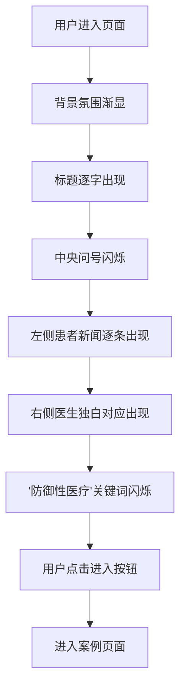

## 1. 产品概述

"认知冲突序幕页"是一个沉浸式医疗案例科普网站的开篇页面，旨在通过双视角对比展示医患之间的认知鸿沟，激发用户的好奇心和探索欲，引导用户深入了解后续案例。

- **核心目的**：用强烈的视觉冲击和情感共鸣，让用户直观感受到医患之间"那道看不见的墙"，产生深入了解的欲望
- **目标用户**：对医疗话题感兴趣的普通大众、医学生、医疗从业者
- **产品价值**：打破信息壁垒，促进医患理解，用故事化方式传递医疗知识

## 2. 核心功能

### 2.1 用户角色
| 角色 | 注册方式 | 核心权限 |
|------|----------|----------|
| 访客用户 | 无需注册 | 浏览序幕页、进入后续案例 |

### 2.2 功能模块
1. **序幕页**：全屏沉浸式开场，双视角对比展示医患认知冲突
2. **进入入口**：引导用户点击进入案例详情

### 2.3 页面详情
| 页面名称 | 模块名称 | 功能描述 |
|----------|----------|----------|
| 序幕页 | 背景氛围层 | 灰暗医院走廊背景（模糊压抑），中央巨大闪烁问号 |
| 序幕页 | 顶部标题 | "医患之间，隔着一道墙。" 大标题，渐入动画 |
| 序幕页 | 患者视角栏 | 左侧滚动播放4条真实新闻标题，配情绪图标 |
| 序幕页 | 医生视角栏 | 右侧对应展示医生内心独白（对话气泡形式） |
| 序幕页 | 关键词高亮 | 右侧最终浮现"防御性医疗"关键词，闪烁强调 |
| 序幕页 | 进入按钮 | 底部"走进墙的另一边"入口按钮，引导进入案例 |

## 3. 核心流程

用户进入页面 → 背景氛围渐显 → 标题逐字出现 → 中央问号闪烁吸引注意 → 左右双栏内容逐条交替出现（患者新闻→医生独白）→ 最后"防御性医疗"关键词闪烁强调 → 用户点击"走进墙的另一边" → 进入案例页面

## 4. 用户界面设计

### 4.1 设计风格
- **主色调**：深灰蓝（#1a1f2e）为主背景，营造压抑沉重的医院氛围
- **辅助色**：冷白色（#e8e8e8）用于文字，微弱暖橙色（#d4724a）作为强调色
- **分割色**：中央一道细弱的白光/红光分界线，象征"墙"
- **字体**：标题使用方正粗犷的宋体/衬线体增强厚重感，正文使用清晰的无衬线体
- **布局风格**：左右双栏对称布局，中央有明显的分割视觉元素
- **图标风格**：简约线条情绪图标（愤怒、困惑、悲伤）

### 4.2 页面设计概览
| 页面名称 | 模块名称 | UI元素 |
|----------|----------|--------|
| 序幕页 | 背景层 | 模糊医院走廊图 + 深色渐变叠加 + 噪点纹理 + 缓慢呼吸的光晕 |
| 序幕页 | 中央问号 | 巨大"？"符号，半透明，缓慢闪烁，带模糊光晕 |
| 序幕页 | 顶部标题 | 大号衬线字体，逐字淡入，字间距宽松 |
| 序幕页 | 双栏布局 | 左右各占45%，中央10%为分隔区（墙的视觉隐喻） |
| 序幕页 | 患者视角卡片 | 左侧卡片从左滑入，配红色调情绪图标，新闻标题加粗 |
| 序幕页 | 医生独白气泡 | 右侧对话气泡从右滑入，带指向左侧的气泡尾巴 |
| 序幕页 | 关键词 | "防御性医疗"大号字体，橙红色，脉冲式闪烁 |
| 序幕页 | 进入按钮 | 底部居中，圆角按钮，悬停有发光效果 |

### 4.3 响应式
- 桌面端优先设计（1280px+）
- 平板端：双栏改为上下堆叠，中央分隔线变为水平分隔
- 移动端：单列布局，字号适配，动画简化

### 4.4 动效设计
- **入场动画**：背景从全黑渐显，标题逐字淡入，整体有电影开场的仪式感
- **内容出现**：左右交替出现，左侧滑入→右侧气泡弹出，逐条递进
- **闪烁效果**：问号和关键词使用 opacity + scale 的脉冲动画
- **悬停交互**：按钮悬停时轻微放大并发光，新闻条目悬停时微亮
- **滚动提示**：底部有轻微的向下滚动指引动效
