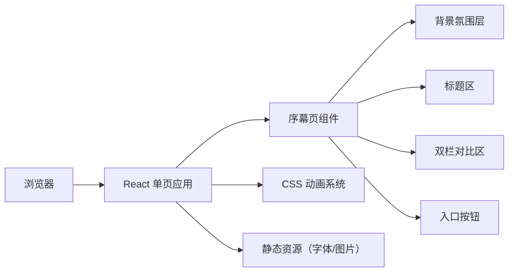

## 1. 架构设计



## 2. 技术选型

- **前端框架**：React@18 + TypeScript
- **构建工具**：Vite@5
- **样式方案**：TailwindCSS@3 + CSS 自定义动画
- **动画实现**：CSS keyframes + React state 控制动画序列
- **字体方案**：Google Fonts 中文衬线体 + 无衬线体
- **背景图片**：使用在线图片 API 生成医院走廊氛围图

## 3. 目录结构

```
src/
├── components/
│   ├── Prologue/
│   │   ├── BackgroundLayer.tsx    # 背景氛围层
│   │   ├── TitleSection.tsx       # 标题区
│   │   ├── PatientColumn.tsx      # 患者视角栏
│   │   ├── DoctorColumn.tsx       # 医生视角栏
│   │   ├── CentralDivider.tsx     # 中央分隔墙
│   │   └── EnterButton.tsx        # 进入按钮
│   └── ProloguePage.tsx           # 序幕页主组件
├── data/
│   └── conflicts.ts               # 冲突数据
├── hooks/
│   └── useAnimationSequence.ts    # 动画序列控制hook
├── styles/
│   └── animations.css             # 全局关键帧动画
├── App.tsx
├── main.tsx
└── index.css
```

## 4. 核心组件说明

| 组件 | 职责 | 关键 props |
|------|------|------------|
| ProloguePage | 统筹整个序幕页，控制动画时序 | - |
| BackgroundLayer | 渲染背景图、渐变、噪点、问号 | show: boolean |
| TitleSection | 渲染主标题，逐字动画 | show: boolean |
| PatientColumn | 渲染患者视角新闻列表 | activeIndex: number |
| DoctorColumn | 渲染医生独白气泡 + 关键词 | activeIndex: number, showKeyword: boolean |
| CentralDivider | 中央"墙"的视觉元素 | show: boolean |
| EnterButton | 底部进入按钮 | show: boolean |

## 5. 数据模型

```typescript
interface ConflictItem {
  id: number;
  patient: {
    title: string;
    emotion: 'anger' | 'confusion' | 'sadness';
  };
  doctor: {
    monologue: string;
  };
}

const conflicts: ConflictItem[] = [
  {
    id: 1,
    patient: { title: '患者突发心梗，家属质疑医院未及时做CT', emotion: 'anger' },
    doctor: { monologue: '我们开检查，是因为症状不典型，想排除致命风险。' }
  },
  {
    id: 2,
    patient: { title: '医生开抽血化验，被患者投诉"过度医疗"', emotion: 'anger' },
    doctor: { monologue: '很多疾病早期症状相似，化验是为了精准诊断，避免漏诊。' }
  },
  {
    id: 3,
    patient: { title: '门诊5分钟看完，患者不满：我花了钱，你就说这几句？', emotion: 'sadness' },
    doctor: { monologue: '门诊限号，每个患者我只能分到4-5分钟，但我尽力了。' }
  },
  {
    id: 4,
    patient: { title: '手术前签同意书，患者怒斥：你们是想推卸责任！', emotion: 'anger' },
    doctor: { monologue: '术前告知是法律要求，更是为了保护患者知情权。' }
  }
];
```

## 6. 动画时序设计

| 时间点 | 事件 | 动画类型 | 持续时间 |
|--------|------|----------|----------|
| 0ms | 背景渐显 | fadeIn | 2000ms |
| 500ms | 标题逐字出现 | letterFadeIn | 2000ms |
| 2500ms | 中央问号开始闪烁 | pulse | 无限循环 |
| 3000ms | 中央分隔墙出现 | wallReveal | 1500ms |
| 4000ms | 第1条患者新闻滑入 | slideInLeft | 800ms |
| 4800ms | 第1条医生独白弹出 | bubblePop | 600ms |
| 5800ms | 第2条患者新闻滑入 | slideInLeft | 800ms |
| 6600ms | 第2条医生独白弹出 | bubblePop | 600ms |
| 7600ms | 第3条患者新闻滑入 | slideInLeft | 800ms |
| 8400ms | 第3条医生独白弹出 | bubblePop | 600ms |
| 9400ms | 第4条患者新闻滑入 | slideInLeft | 800ms |
| 10200ms | 第4条医生独白弹出 | bubblePop | 600ms |
| 11500ms | "防御性医疗"关键词浮现 | keywordReveal | 1500ms |
| 13000ms | 进入按钮出现 | buttonRise | 1000ms |
